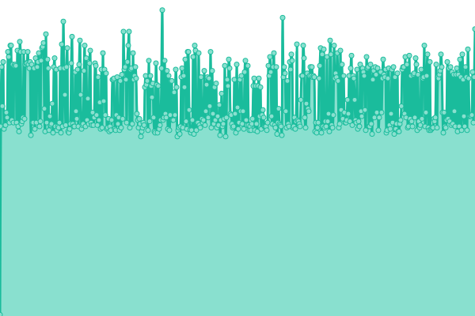
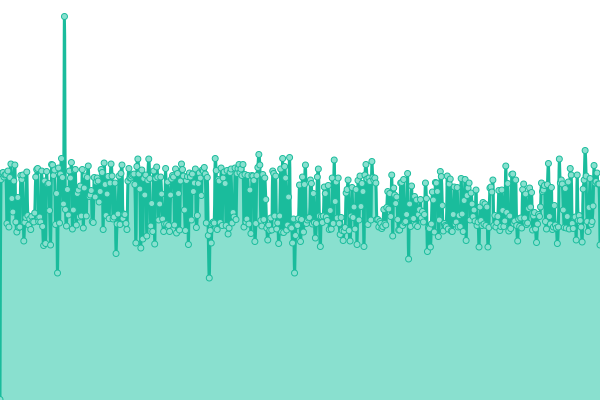
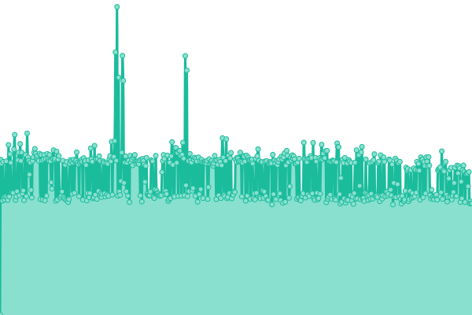

# [📈 Live Status](https://status.rootk1d.xyz): <!--live status--> **🟨 Degraded performance**

This repository contains the open-source uptime monitor and status page for [Upptime](https://upptime.js.org), powered by [Upptime](https://github.com/upptime/upptime).

With [Upptime](https://upptime.js.org), you can get your own unlimited and free uptime monitor and status page, powered entirely by a GitHub repository. We use [Issues](https://github.com/upptime/upptime/issues) as incident reports, [Actions](https://github.com/roo7k1d/status-page/actions) as uptime monitors, and [Pages](https://status.rootk1d.xyz) for the status page.

<!--start: status pages-->
<!-- This summary is generated by Upptime (https://github.com/upptime/upptime) -->
<!-- Do not edit this manually, your changes will be overwritten -->
<!-- prettier-ignore -->
| URL | Status | History | Response Time | Uptime |
| --- | ------ | ------- | ------------- | ------ |
|  [Rootk1d.xyz](https://rootk1d.xyz) | 🟩 Up | [rootk1d-xyz.yml](https://github.com/Roo7K1d/status-page/commits/HEAD/history/rootk1d-xyz.yml) | 

 485ms
     
 | 

<a href="https://status.rootk1d.xyz/history/rootk1d-xyz">100.00%</a>
    

|  [Discord FunTasticBot](https://rootk1d.xyz/discord-ftb) | 🟨 Degraded | [discord-fun-tastic-bot.yml](https://github.com/Roo7K1d/status-page/commits/HEAD/history/discord-fun-tastic-bot.yml) | 

 169ms
     
 | 

<a href="https://status.rootk1d.xyz/history/discord-fun-tastic-bot">2.96%</a>
    

|  [PaD-Organizer Demo Page](https://rootk1d.xyz/pad-demo) | 🟩 Up | [pa-d-organizer-demo-page.yml](https://github.com/Roo7K1d/status-page/commits/HEAD/history/pa-d-organizer-demo-page.yml) | 

 501ms
     
 | 

<a href="https://status.rootk1d.xyz/history/pa-d-organizer-demo-page">1.75%</a>
    

|  [Github-Repo-List Demo Page](https://rootk1d.xyz/repos) | 🟩 Up | [github-repo-list-demo-page.yml](https://github.com/Roo7K1d/status-page/commits/HEAD/history/github-repo-list-demo-page.yml) | 

 374ms
     
 | 

<a href="https://status.rootk1d.xyz/history/github-repo-list-demo-page">99.79%</a>
    

|  [RP-Police-Database Demo Page](https://rootk1d.xyz/police) | 🟩 Up | [rp-police-database-demo-page.yml](https://github.com/Roo7K1d/status-page/commits/HEAD/history/rp-police-database-demo-page.yml) | 

 497ms
     
 | 

<a href="https://status.rootk1d.xyz/history/rp-police-database-demo-page">100.00%</a>
    

<!--end: status pages-->

[**Visit our status website →**](https://status.rootk1d.xyz)

## 📄 License

- Powered by: [Upptime](https://github.com/upptime/upptime)
- Code: [MIT](./LICENSE) © [Upptime](https://upptime.js.org)
- Data in the `./history` directory: [Open Database License](https://opendatacommons.org/licenses/odbl/1-0/)
